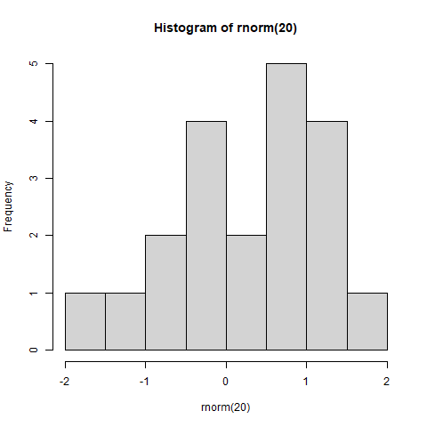

<!-- Frequent Worries about RCTs: Questions and Answers -->

<!-- Author: Macartan Humphreys -->

an rmd file

-   TOC 
{:toc}


# Estimation

# Figure

$$\frac{1}2 = \pi$$


footnote with math not working[^1]

[^1]: This will become a hoverable footnote: $a^b = \frac{1}2$ and \[a^b\]
  More note
  
``` r
png("../assets/img/posts/hist.png")
hist(rnorm(20))
dev.off()
```

    ## png 
    ##   2

``` r

```


``` r
# knitr::include_graphics("assets/img/posts/hist.png")

knitr::include_graphics("https://macartan.github.io/assets/img/posts/hist.jpg")
```

<!-- -->
